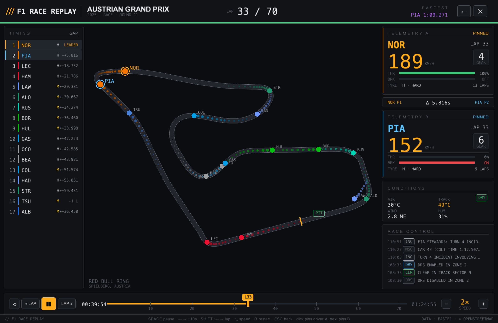
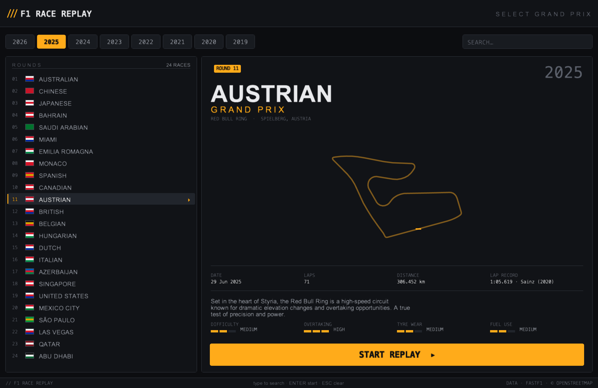

# F1 Race Replay

Replay any Formula 1 race from real telemetry — every car animated on an
accurate track map, with a live timing tower, twin driver-telemetry cards,
weather, and the official race-control feed. Built with
[Arcade](https://api.arcade.academy/) and [FastF1](https://docs.fastf1.dev/).

The UI is a custom design system: a pit-wall engineering console
aesthetic — graphite carbon surfaces, hairline borders, monospaced data, a
single amber accent, purple reserved for the fastest lap.





> **Source-available, not open source.** This code is published so it can be
> read and evaluated. It is **not licensed for use** — see [LICENSE](LICENSE).
> No permission is granted to run, copy, modify or redistribute it.

## Requirements

Python 3.10+ and an OpenGL-capable machine. Dependency versions are pinned in
[`pyproject.toml`](pyproject.toml) and [`requirements.lock`](requirements.lock).

### No API keys

The app needs no account, token or API key. Timing and telemetry are read from
publicly accessible sources at runtime; nothing is bundled in this repository.

## Command line

The application exposes a single command:

```text
f1replay                        # session-select screen
f1replay austria                # latest season's Austrian Grand Prix
f1replay austria 2019           # the 2019 Austrian Grand Prix
f1replay monaco 2022 -s 5       # Monaco 2022 at 5x speed
f1replay --round 11 2025        # by round number
f1replay --list 2019            # print that season's calendar
```

Race names match on the event name, circuit location or country, and an
ambiguous name is **refused rather than guessed** — `f1replay spa 2019` matches
both Spa-Francorchamps and the Spanish GP, so it asks you to be specific.

| flag | |
|---|---|
| `-r`, `--round N` | select by round number |
| `-l`, `--list [YEAR]` | print a season's calendar and exit |
| `-s`, `--speed N` | initial playback speed (0.25–20) |
| `--session CODE` | `R` race, `Q` qualifying, `S` sprint (default `R`) |
| `--cache PATH` | telemetry cache directory |
| `-V`, `--version` | print version |

Seasons from **2019 to the current year** are available. Each season's
calendar is read from the real F1 schedule, so historical one-offs (the
Styrian, Eifel, Tuscan, 70th Anniversary and Sakhir Grands Prix) are all
replayable, the current season appears as its races are run, and a new season
needs no update. Rounds that have not happened yet are hidden.

The first load of any session downloads timing and telemetry data and caches
it — roughly a minute the first time, a few seconds afterwards.

## Controls

| Input | Action |
|---|---|
| `SPACE` | Pause / resume |
| `←` / `→` | Skip 10 s back / forward |
| `SHIFT` + `←` / `→` | Skip to previous / next lap |
| `« LAP` / `LAP »` buttons | Skip to previous / next lap |
| `↑` / `↓` | Playback speed (0.25× → 0.5× → 1× → 2× → 5× → 10× → 20×) |
| `R` | Restart the race |
| `ESC` | Back to session select |
| Click car / tower row | Pin Driver A, then Driver B |
| Click a pinned driver | Unpin (B promotes to A) |
| Click empty track | Clear both pins |
| Drag the scrubber | Seek anywhere in the race |

## Features

- **Session select** — pick any season from 2019 to the current one, and any round of that
  season's real calendar; previews show the circuit outline, race facts, lap
  record, and circuit-character meters.
- **Full race replay** — every car moves on a GPS-accurate track map with
  ghost trails, pit-entry marker, and start/finish line. Retirements leave
  the track when they retire.
- **Timing tower** — live positions, team colours, tyre compound, and gap to
  leader for the whole field.
- **Driver comparison** — click a car (or a tower row) to pin **Driver A**
  (amber), click another to pin **Driver B** (cyan). Each gets a full
  telemetry card (speed, gear, throttle, brake, tyre & stint) and a live
  **Δ interval** strip. Hovering previews any driver without disturbing pins.
- **Race control feed** — official FIA messages with category tags; safety
  car / VSC / red flag periods tint the feed and flip the status strip under
  the header; per-driver incidents flash on the relevant telemetry card.
- **Fastest lap** — the purple time is the fastest lap set *so far*, so a
  replay doesn't spoil its own ending.
- **Weather** — air/track temperature, wind speed and direction, humidity,
  and a DRY/WET state tag.
- **Transport bar** — play/pause, lap-by-lap skip, restart, a scrubber with
  lap-number ticks, and a playback-speed stepper (0.25× – 20×).

## Cache

Session data is cached per-user, outside the project:

| | |
|---|---|
| macOS | `~/Library/Caches/f1replay` |
| Linux | `$XDG_CACHE_HOME/f1replay` (or `~/.cache/f1replay`) |
| Windows | `%LOCALAPPDATA%\f1replay\Cache` |

Override with `--cache PATH` or `$F1REPLAY_CACHE`. A full season of races runs
to a couple of gigabytes; delete the directory to reclaim it.

## Dependencies

Version ranges live in [`pyproject.toml`](pyproject.toml) — the single source
of truth. [`requirements.lock`](requirements.lock) records the exact
environment this was built and tested against: 44 packages, Python 3.14.2.

All dependencies are permissive-licensed (MIT, BSD, Apache-2.0, PSF, and
MPL-2.0 for `certifi`); none are copyleft and none are vendored here.

## Project layout

```
main.py              entry point for a source checkout
pyproject.toml       package metadata, dependency ranges, `f1replay` command
requirements.lock    exact tested environment
f1replay/
  cli.py               argument parsing, race resolution
  app.py               window setup
  config.py            replay settings, cache location
  core/
    calendar.py          real season schedules; resolves a race to a round
    data_loader.py       session, telemetry, timing stream
    replay_data.py       loads a replay off the UI thread
    indexers.py          weather / laps / race-control / position indexes
    track_geometry.py    world→screen transform, track edges
  panels/
    leaderboard.py       timing tower
    stats.py             telemetry comparison cards
    weather.py           conditions grid
    race_control.py      FIA message feed
    driver_radio.py      per-driver incident strip
  ui/
    design.py            F1 RACE REPLAY palette, type scale, components
    circuits.py          real circuit outlines (generated — see Licence)
    selection.py         session select + loading views
    window.py            race view, transport, input
    text_cache.py        cached text renderer
    picking.py           car / row hit-testing
```

## Data sources

- **Telemetry, timing, weather, race control** — fetched via
  [FastF1](https://docs.fastf1.dev/) from publicly accessible sources.
- **Circuit preview outlines** — `f1replay/ui/circuits.py` is generated from the
  [f1-circuits](https://github.com/bacinger/f1-circuits) GeoJSON dataset
  (© OpenStreetMap contributors, ODbL): real GPS centerlines,
  latitude-corrected and normalized with true aspect ratio, north up.
  Regenerate from the dataset rather than editing by hand.

## Known limitations

**Occasional bad position fixes.** The F1 position feed sometimes places a car
tens or hundreds of metres from where it actually is, for a sample or two,
before correcting itself. It is rare -- 0.02% to 0.3% of samples depending on
the session -- but it clusters around race starts, where the field is slow and
bunched and a bad fix is most visible. The clearest example is Monaco 2022,
where the leader's first ~6 seconds are stale and the car appears to jump
backwards once the feed corrects.

This is upstream data, not a replay bug: FastF1's own `get_telemetry()`
returns the same values, the samples carry `Status=OnTrack` with strictly
monotonic timestamps, and nothing marks them as suspect. They are step
changes to a wrong position rather than out-and-back spikes, so outlier
filtering does not catch them -- correcting it properly would mean
reconciling positions against the timing stream.

**Circuit outlines cover a fixed set of venues.** Le Castellet, Hockenheim,
the Nurburgring, Mugello, Portimao, Sochi, Istanbul and newer additions such
as Madrid have no preview outline, and no editorial facts. Those events still
replay normally -- the track map during the race is drawn from live telemetry,
not from these assets -- and the select screen shows "CIRCUIT DATA
UNAVAILABLE" with em-dashed stats. To add one, regenerate `ui/circuits.py`
from the f1-circuits dataset and add a `_LOCATION_TO_CIRCUIT` entry.

**Lap records are circuit constants.** The lap record shown on the select
screen is the current record for that circuit, so it can post-date the season
you are viewing.

## Licence

**Copyright (c) 2026 Manshul. All Rights Reserved.** No permission is granted
to use, copy, run, modify or redistribute this software. Public visibility of
this repository does not grant a licence to it. See [LICENSE](LICENSE).

One exception: `f1replay/ui/circuits.py` is not the author's work to restrict.
It is OpenStreetMap-derived data under the
[ODbL](https://opendatacommons.org/licenses/odbl/1-0/) and remains available
under those terms, with attribution, independently of the above.

Third-party dependencies are not distributed here and remain under their own
licences (MIT, BSD, Apache-2.0, PSF, and MPL-2.0 for `certifi`).

This is an unofficial project and is not associated with Formula 1 or the FIA.
